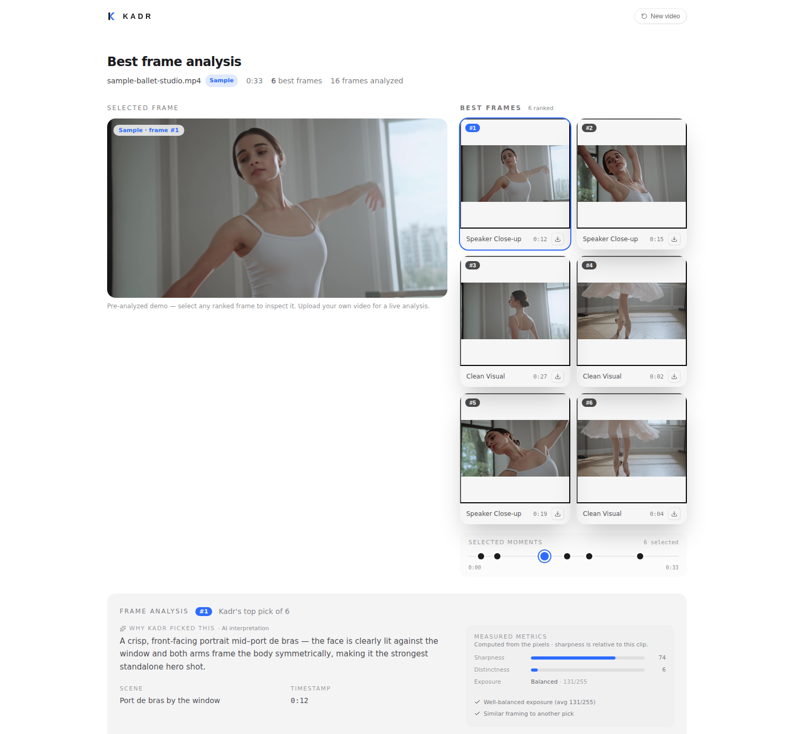

# Kadr

**Kadr finds the best frame in your video, automatically.** Upload a clip, and Gemini watches it, ranks the strongest moments, and explains *why* each one was picked — sharp focus, good expression, clean composition. No more scrubbing through footage by hand to find the one frame worth keeping.

**[Try the live demo →](https://video-agent-7rzs.vercel.app/)** — no upload needed, click "Try a sample clip" to see it in action instantly.



Built with Gemini, FastAPI, and React.

## What it does

1. Upload any video (mp4, mov, avi, webm, mkv)
2. Gemini groups the footage into scenes and ranks every sampled frame for sharpness, faces, and composition, with a written explanation for each pick
3. Browse the ranked frames in a grid, inspect the AI reasoning plus deterministic (pixel-computed) sharpness/exposure metrics for any frame, and download your picks as JPEGs
4. Optionally resize (smart crop) or expand (generative outpaint) any frame to a new aspect ratio right from the frame lightbox

Older experimental features — turning a frame into a die-cut sticker, or exporting 16:9/9:16 asset packs — still exist in the codebase but are currently hidden behind feature flags while the product focuses on best-frame analysis.

## Stack

- **Frontend** — React 18 + TypeScript + Vite
- **Backend** — FastAPI (Python)
- **AI** — Gemini (multimodal frame scoring + image generation)
- **Video processing** — ffmpeg-python (frame extraction)

## Setup

**Requirements:** Python 3.12, Node 18+, ffmpeg

```bash
# 1. Clone
git clone <repo-url>
cd video-agent

# 2. Backend
cd backend
python3.12 -m venv .venv
source .venv/bin/activate
pip install -r requirements.txt
cp .env.example .env
# Add your GEMINI_API_KEY to .env (get one at aistudio.google.com)

# 3. Frontend
cd ../frontend
npm install

# 4. Run
cd ..
./start.sh
```

Open `http://localhost:5173`

## API

`POST /best-frames` — the primary endpoint, used by the live app. Accepts a video file + optional prompt. Gemini groups the video into scenes, picks the top candidate frames per scene, and returns them ranked as base64 JPEGs with metadata: timestamp, overall score, sub-scores (sharpness, face, composition), grounded evidence bullets, and deterministic pixel-computed metrics (sharpness, exposure).

`POST /reframe` — accepts an image file + `aspect` (`16:9`, `9:16`, `1:1`). Gemini detects the subject's bounding box and the image is cropped to that aspect keeping the subject centered (no upscaling or generative expansion). Powers **Resize** in the frame lightbox. Returns a JPEG.

`POST /expand` — accepts an image file + either a preset `aspect` or independent `left`/`right`/`top`/`bottom` drag-out fractions, and generatively outpaints the image to fill the new canvas. Powers **Expand** in the frame lightbox. Returns a JPEG.

The routes below are **legacy / dormant** — implemented and tested, but hidden from the primary UI behind a feature flag (`ASSET_GENERATION` in `frontend/src/features.ts`) and not reachable from the live demo:

`POST /asset-pack` — accepts a video file + optional `prompt`, `count` (best frames, default 5), and `sticker_style`. Runs the full pipeline and **streams** SSE events as assets become ready: `status` (per stage), `frames` (the best-frame set), then `asset` events for the 16:9 thumbnail, 9:16 story, and stickers, ending with `done`. Lets the UI reveal assets incrementally.

`POST /sticker` — accepts an image file + `style` + `format` (`png`, `webp`). Styles: `cutout` (faithful Apple-style subject lift, keeps real pixels — best for people/pets/products), `photo` (whole-frame rounded-corner photo sticker, no model call — best for scenes/landscapes), and `cartoon`, `3d`, `pixel`, `oil` (generative redraws). All get a white die-cut outline and are tight-cropped; generative and cutout outputs are chroma-keyed from a magenta background to real transparency. Returns the sticker image.
